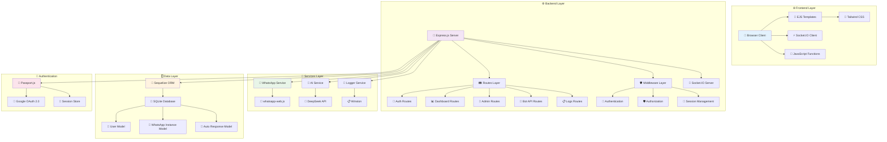
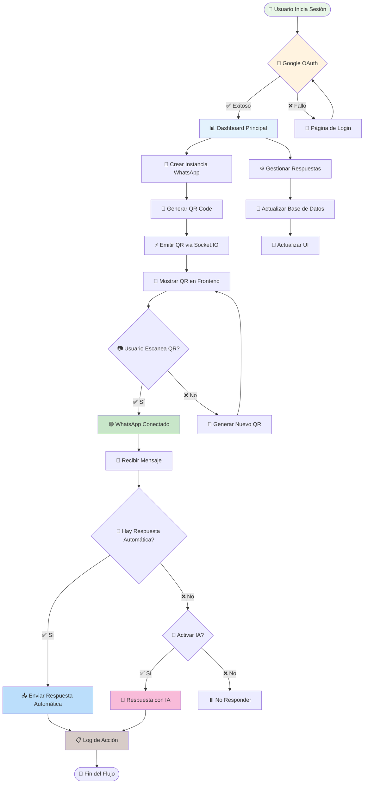
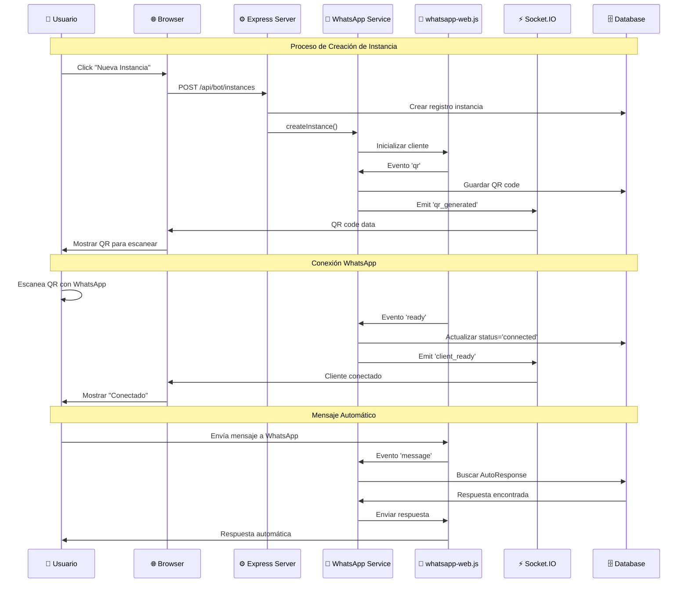
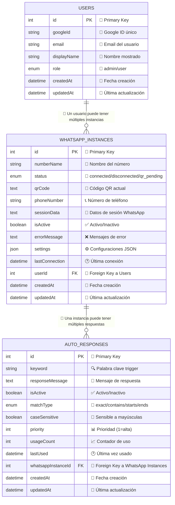
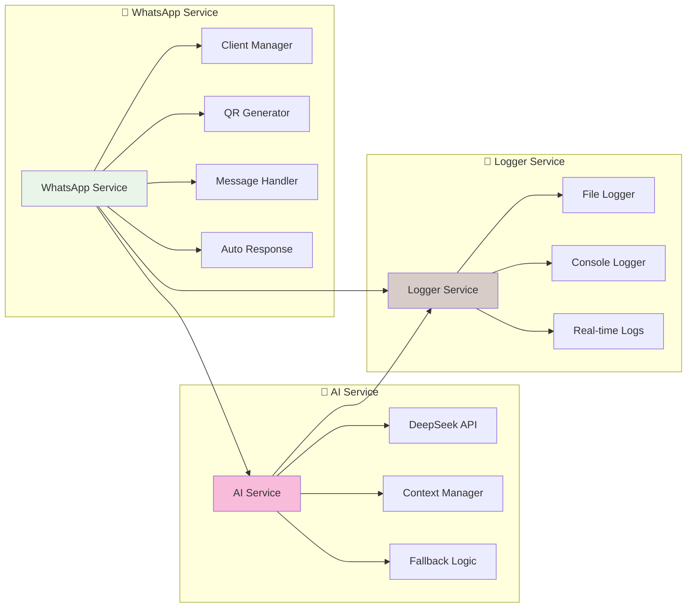
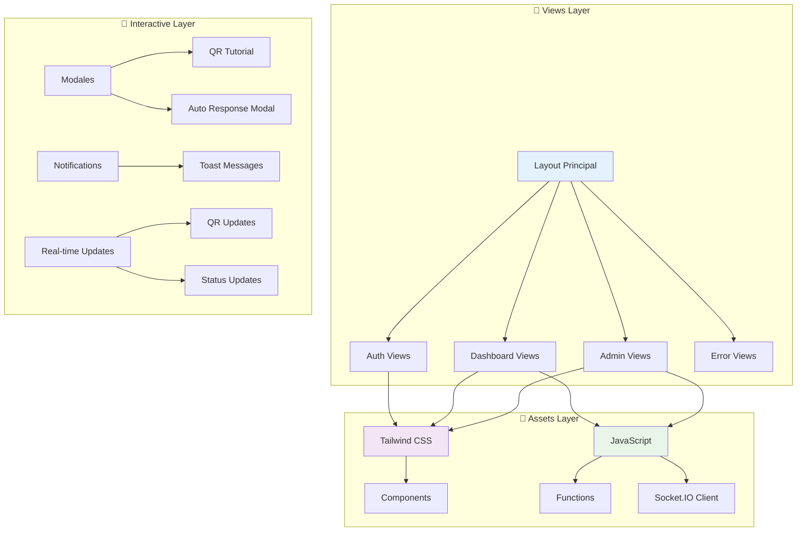
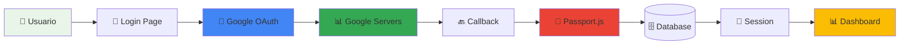

# 📊 WhatsaBoot - Diagramas de Arquitectura

Este documento contiene todos los diagramas visuales de la arquitectura de WhatsaBoot.

## 🏗️ Arquitectura del Sistema

### Vista General de Componentes

## 🔄 Flujos de Datos

### Flujo Principal de Usuario

### Flujo de Creación de Instancia WhatsApp

## 🗄️ Modelo de Base de Datos

### Diagrama Entidad-Relación

## 🔧 Arquitectura de Servicios

### Diagrama de Servicios

## 🌐 Arquitectura Frontend

### Componentes de Vista

## 🔐 Flujo de Autenticación

### Proceso OAuth 2.0

## 📊 Responsabilidades por Capa

### Frontend Layer
- 🎨 **Renderizado de UI** (EJS + Tailwind)
- ⚡ **Interacciones en tiempo real** (Socket.IO)
- 📱 **Gestión de estados** (JavaScript)
- 🎯 **Experiencia de usuario** (Modales, notificaciones)

### Backend Layer
- 🛤️ **Routing y middleware** (Express.js)
- 🔐 **Autenticación y autorización** (Passport.js)
- 📡 **API REST** (CRUD operations)
- 🔄 **Comunicación en tiempo real** (Socket.IO Server)

### Services Layer
- 📱 **Lógica de negocio WhatsApp** (WhatsappService)
- 🤖 **Procesamiento IA** (AIService)
- 📝 **Logging centralizado** (Winston)

### Data Layer
- 🗄️ **Persistencia de datos** (SQLite)
- 🔗 **ORM y relaciones** (Sequelize)
- 📊 **Modelos de negocio** (User, Instance, Response)

---

## 📈 Métricas de Arquitectura

### Cobertura de Funcionalidades
- **Autenticación:** 100% ✅
- **Gestión WhatsApp:** 100% ✅
- **Admin Panel:** 100% ✅
- **API REST:** 100% ✅
- **Real-time:** 100% ✅
- **Frontend:** 100% ✅
- **Logging:** 90% ✅
- **IA Integration:** 20% 🚧

### Escalabilidad
- **Usuarios concurrentes:** ✅ Soportado
- **Instancias WhatsApp:** ✅ Múltiples por usuario
- **Base de datos:** ✅ SQLite para small-medium scale
- **Sesiones:** ✅ Express sessions escalables

---

*Para más detalles técnicos, consulta `ARCHITECTURE.md` y `STATUS_REPORT.md`*
