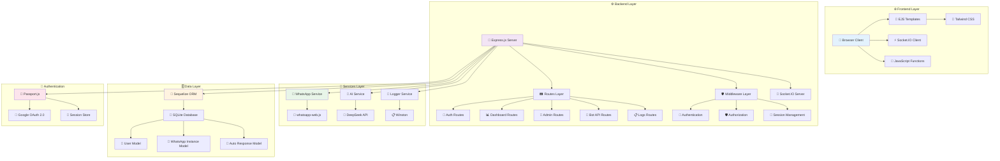
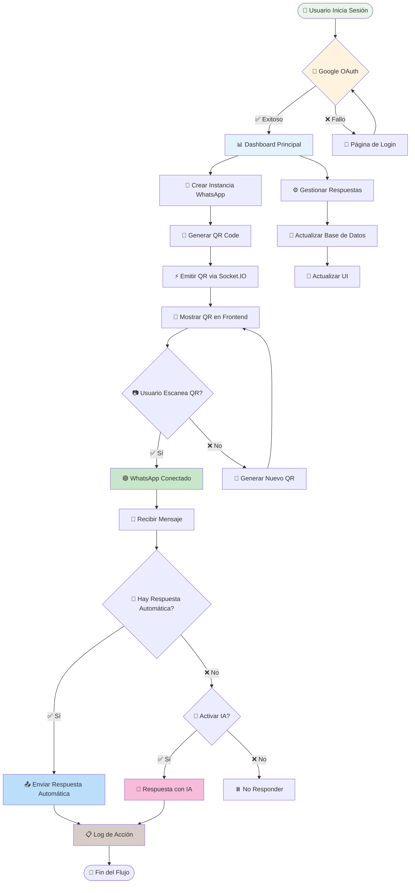
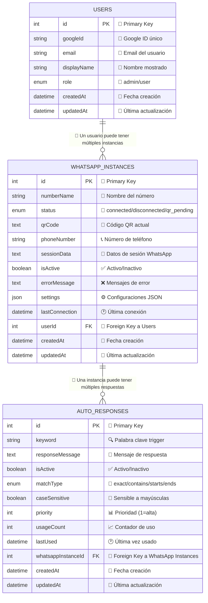

# 🚀 WhatsaBoot

**Sistema de gestión de bots de WhatsApp con backoffice administrativo**

WhatsaBoot es una aplicación web completa para gestionar múltiples instancias de WhatsApp con respuestas automáticas, panel administrativo y autenticación OAuth.

## ✨ Características

### 🔐 **Autenticación y Usuarios**
- ✅ Login con Google OAuth 2.0
- ✅ Sistema de roles (admin/user)
- ✅ Gestión de usuarios desde panel admin
- ✅ Primer usuario registrado es automáticamente admin

### 📱 **Gestión de WhatsApp**
- ✅ Múltiples instancias de WhatsApp por usuario
- ✅ Generación automática de códigos QR
- ✅ Conexión en tiempo real con Socket.IO
- ✅ Estados de conexión (conectado/desconectado/esperando QR)
- ✅ Tutorial animado para escaneo de QR

### 🤖 **Respuestas Automáticas**
- ✅ Configuración de palabras clave
- ✅ Respuestas personalizadas por instancia
- ✅ Gestión completa CRUD de respuestas
- ✅ Sistema de coincidencias flexible

### 🎛️ **Panel Administrativo**
- ✅ Dashboard moderno y responsivo
- ✅ Gestión de usuarios y roles
- ✅ Administración de números WhatsApp
- ✅ Panel de logs y debugging en tiempo real
- ✅ Estadísticas del sistema

### 🛠️ **Tecnologías**
- **Backend:** Node.js + Express.js
- **Base de Datos:** SQLite + Sequelize ORM
- **Frontend:** EJS Templates + Tailwind CSS
- **Autenticación:** Passport.js + Google OAuth 2.0
- **WhatsApp:** whatsapp-web.js
- **Real-time:** Socket.IO
- **Logging:** Winston

## 🏗️ Diagramas de Arquitectura

### 📊 Arquitectura del Sistema



### 🔄 Flujo de Datos Principal



### 🗄️ Modelo de Base de Datos



> 📊 **Para ver más diagramas detallados de arquitectura, consulta [DIAGRAMS.md](./DIAGRAMS.md)**

## 🚀 Instalación Rápida

### Prerrequisitos
- Node.js 16+ 
- NPM o Yarn
- Cuenta Google Cloud (para OAuth)

### 1. Clonar el repositorio
```bash
git clone https://github.com/tu-usuario/whatsaboot.git
cd whatsaboot
```

### 2. Instalar dependencias
```bash
npm install
```

### 3. Configurar variables de entorno
```bash
cp .env.example .env
```

Edita `.env` con tus credenciales:
```bash
PORT=3000
SESSION_SECRET=tu_session_secret_super_seguro
GOOGLE_CLIENT_ID=tu_google_client_id
GOOGLE_CLIENT_SECRET=tu_google_client_secret
GOOGLE_CALLBACK_URL=http://localhost:3000/auth/google/callback
DATABASE_URL=./database/whatsaboot.db
DEEPSEEK_API_KEY=tu_deepseek_api_key
DEEPSEEK_API_URL=https://api.deepseek.com/v1
```

### 4. Configurar la aplicación
```bash
npm run setup
```

### 5. Iniciar la aplicación
```bash
npm start
```

🎉 **¡Listo!** Ve a `http://localhost:3000`

## 📋 Scripts Disponibles

```bash
# Iniciar aplicación
npm start

# Configuración inicial
npm run setup

# Verificar estado del sistema
npm run health-check
```

## 🔧 Configuración Google OAuth

### 1. Crear proyecto en Google Cloud Console
1. Ve a [Google Cloud Console](https://console.cloud.google.com/)
2. Crea un nuevo proyecto o selecciona uno existente
3. Habilita la "Google+ API"

### 2. Configurar OAuth 2.0
1. Ve a "Credenciales" → "Crear credenciales" → "ID de cliente OAuth 2.0"
2. Tipo de aplicación: "Aplicación web"
3. URIs de redirección autorizados: `http://localhost:3000/auth/google/callback`
4. Copia `Client ID` y `Client Secret` al archivo `.env`

## 📖 Guía de Uso

### 👤 **Como Usuario**
1. **Login:** Entra con tu cuenta Google
2. **Crear Instancia:** Clic en "Nueva Instancia"
3. **Escanear QR:** Usa WhatsApp → Dispositivos vinculados → Vincular dispositivo
4. **Configurar Respuestas:** Agrega palabras clave y respuestas automáticas

### 👨‍💼 **Como Administrador**
1. **Gestión de Usuarios:** `/admin/users` - Ver y cambiar roles
2. **Gestión de Números:** `/admin/numbers` - Administrar instancias WhatsApp
3. **Logs del Sistema:** `/admin/logs` - Monitoreo en tiempo real
4. **Estadísticas:** Dashboard con métricas del sistema

## 📁 Estructura del Proyecto

```
WhatsaBoot/
├── 📁 config/          # Configuración (DB, Passport, Logger)
├── 📁 controllers/     # Lógica de controladores
├── 📁 middleware/      # Middlewares de autenticación
├── 📁 models/          # Modelos de base de datos
├── 📁 routes/          # Rutas de la API y vistas
├── 📁 services/        # Servicios (WhatsApp, IA)
├── 📁 views/           # Templates EJS
├── 📁 public/          # Archivos estáticos
├── 📁 scripts/         # Scripts de utilidad
├── 📁 logs/            # Archivos de log
└── 📁 database/        # Base de datos SQLite
```

## 🔄 Estados de Instancia WhatsApp

| Estado | Descripción | Acción |
|--------|-------------|--------|
| `disconnected` | Sin conexión | Mostrar botón "Conectar" |
| `qr_pending` | Esperando escaneo QR | Mostrar código QR |
| `connected` | Conectado y funcionando | Mostrar número y controles |

## 📡 API Endpoints

### Instancias WhatsApp
```bash
POST   /api/bot/instances                     # Crear instancia
GET    /api/bot/instances                     # Listar instancias del usuario
POST   /api/bot/instances/:id/connect         # Conectar instancia
POST   /api/bot/instances/:id/disconnect      # Desconectar instancia
GET    /api/bot/instances/:id/status          # Estado de instancia
```

### Respuestas Automáticas
```bash
POST   /api/bot/instances/:id/autoresponses   # Crear respuesta
GET    /api/bot/instances/:id/autoresponses   # Listar respuestas
PUT    /api/bot/instances/:id/autoresponses/:responseId  # Actualizar
DELETE /api/bot/instances/:id/autoresponses/:responseId  # Eliminar
```

## 🛡️ Seguridad

- ✅ Autenticación OAuth 2.0 obligatoria
- ✅ Middleware de autorización por roles
- ✅ Validación de acceso a instancias
- ✅ Sessions seguras con express-session
- ✅ Variables de entorno para credenciales

## 📊 Base de Datos

### Modelos Principales

**Users**
- `id`, `googleId`, `email`, `displayName`, `role`

**WhatsappInstances** 
- `id`, `numberName`, `status`, `qrCode`, `userId`, `phoneNumber`

**AutoResponses**
- `id`, `keyword`, `responseMessage`, `whatsappInstanceId`, `matchType`

## 🚀 Preparado para IA

El sistema incluye integración preparada para IA (DeepSeek API):
- Servicio `aiService.js` con función `getDeepSeekResponse()`
- Lógica de fallback: respuesta automática → IA → respuesta por defecto
- Fácil activación modificando `services/whatsappService.js`

## 🐛 Debug y Logs

### Logs en Tiempo Real
```bash
# Ver logs generales
tail -f logs/combined.log

# Ver solo logs de WhatsApp
tail -f logs/combined.log | grep "WhatsApp"

# Ver logs de errores
tail -f logs/error.log
```

### Panel de Logs (Admin)
- 📊 Estadísticas del sistema
- 📝 Logs en tiempo real con filtros
- 📁 Visor de archivos de log
- 🧹 Limpieza de logs antiguos

## 🤝 Contribuir

1. Fork el proyecto
2. Crea tu rama: `git checkout -b feature/AmazingFeature`
3. Commit cambios: `git commit -m 'Add AmazingFeature'`
4. Push rama: `git push origin feature/AmazingFeature`
5. Abre Pull Request

## 📄 Licencia

Este proyecto está bajo la licencia MIT. Ver `LICENSE` para más detalles.

## 🆘 Soporte

¿Problemas? ¡Abre un [issue](https://github.com/tu-usuario/whatsaboot/issues)!

### Problemas Comunes

**QR no aparece:**
- Verifica que WhatsApp Web funcione en tu navegador
- Revisa logs en `/admin/logs`
- Comprueba la conexión a internet

**Error de autenticación:**
- Verifica credenciales Google OAuth en `.env`
- Confirma que la URL de callback sea correcta

**Base de datos:**
- Ejecuta `npm run setup` para inicializar
- Verifica permisos de escritura en carpeta `database/`

---

<div align="center">

**⭐ ¡Dale una estrella si te gusta el proyecto! ⭐**

Hecho con ❤️ por [Tu Nombre](https://github.com/fferrerofloripa)

</div>
